#BONUS A - JITTER
It may seem a bit tacked on, but I at least wanted to touch on Jitter and on video processing, right at the end, so that you could at least have a very basic understanding in your mind as you start to work on your final projects.

###WHAT IS A MATRIX
Right off the bat, I'm going to go ahead and say let's not even talk about the 1999 Wachowski Brothers classic. No red pill jokes, no saying "woah". None of that.

_I said no!_

What is a matrix? Well for starters let's just call it a big block of data. We've already looked at lists--you can think of a matrix as a really really long lists. Matrices are useful whenever we want to associate a whole bunch of data with a specific point in time. Video is one place where we encounter matrices a lot, since at a moment in time we've got red-green-blue color data for every single pixel.

Let's get some video data into Max already. The easiest way of all to do this is just to take a video somewhere on your computer and drop it into a patch. This will create a jit.playlist object, which is extremely similar to the playlist~ object that we've encountered earlier in this course. You push play on this bad boy and it starts playing. To actually see the video, we need a destination to send it to. There are two objects for doing this. One is called _jit.pwindow_, which creates a graphics context inside the patch. Another is called _jit.window_, which creates a graphics context in a separate window. Actually I think these are the only two objects for doing this, but I could be wrong. 

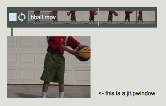

If you're wondering where I got this basketball video, first of all it's _the_ basketball video, second of all it's from the file browser, under Cycling '74 -> Media Files -> Video Files. Oh, and of course you can push the little loopy thing next to the play button to make the video loop.

Fine, let's do something more interesting. Bust out this object called _jit.unpack_. Unlike the regular _unpack_ object, you'll see this one has four outlets instead of two. That's because a default jitter matrix has four planes, one for each of red, green, blue and alpha. In video processing these are usually called channels, but in Jitter we call them planes because they don't always hold video. Anyway, if you use a _jit.unpack_ object with a few _jit.pwindow_ objects, you can see each of the video planes. 

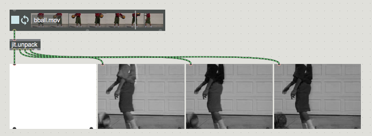

From left to right, we've got alpha, red, green and blue planes. But wait, you're wondering, how come they all look black and white? That's because of jit.pwindow. The _jit.unpack_ object splits the 4 plane video into 1 plane video. When _jit.pwindow_ gets 1 plane video, it interprets it as black and white. But if you use a _jit.pack_ object to put the video back together, you can see the effect of remapping the video channels. 

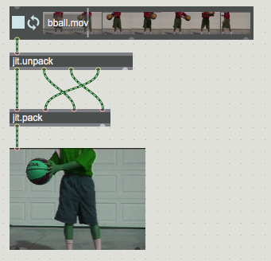

So you know, Max doesn't actually send around the matrix itself, but rather the name of the matrix. That means that regular old objects for routing messages around, like route and gate, work perfectly well on jitter matrixes. Here's how to use _gate_ to "shut off" one of the video channels. A color channel can only get through if the gate is open--otherwise the channel remains "stuck" at a previous value.

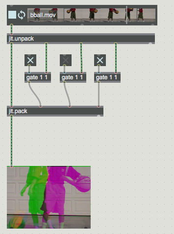

We can also manipulate the color planes of a matrix in a somewhat less drastic way by using a jitter object called _jit.scalebias_. This object lets us apply an addition and multiplication to each of the alpha, red, green and blue channels. To do so, prepend messages to the object with _ascale_, _rscale_, _gscale_ and _bscale_, like in this patch:

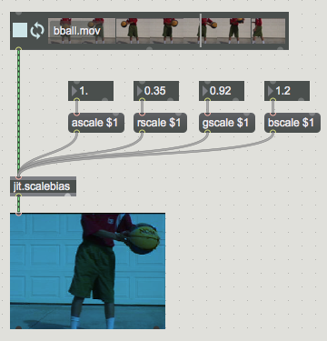

If you're looking for a more dramatic color-based effect, there's also _jit.hue_, which will let you rotate the hue of a video. This keeps the brightness and saturation of the video constant, while rotating each color around the color wheel.

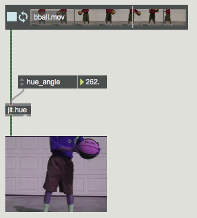

Of course, if you don't want to keep the saturation and brightness constant, then you should reach for the _jit.brcosa_ object, which of course lets you manipulate brightness, contrast and saturation.

###AUDIO POWER
So this is some basic video stuff. Super basic. Like iMovie basic. Cool stuff starts to happen, however, when you try to manipulate your video with sound. To do that, we can use a very basic technique called envelope following, or envelope extraction. The idea is to try to extract from an audio sample a curve representing the overall loudness of the curve. In fact we've already seen most if not all of the objects necessary to do this. The one new one is maybe _abs~_, but all this object does is take the absolute value of a signal.

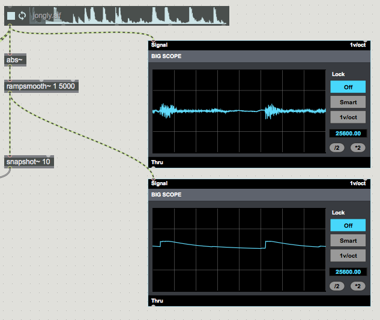

After all that, we just need to take the extracted envelope value and scale it a bit to apply it to an appropriate visual effect. 

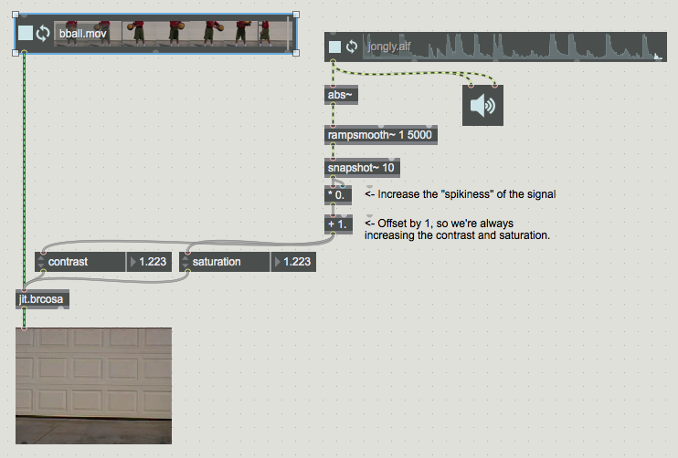

###MIX AND MATCH, SCISSORS AND GLUE

So there's an example of how you can use audio to control video, and we've seen already how you can use the _jit.unpack_ object to split a video up into its constituent planes. But what about splitting up a video along one of its dimensions? Suppose we're interested only in the top-left chunk of the video, for example. Well, enter our good friends _jit.scissors_ and _jit.glue_.

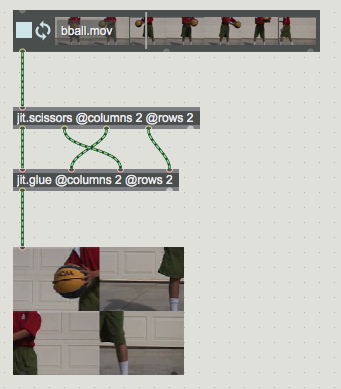

The basic idea is that scissors and glue each cut up a matrix into equally spaced chunks. The number of horizontal chunks is specified by the _columns_ attribute and the number of vertical chunks is determined by the _rows_ attribute. Incidentally, you can see that for these objects we're practically forced to use the "@" attribute syntax that we've danced around all through this course but never formally addressed. Now that we're in Jitter land, it really is unavoidable, however. Many Jitter objects have tons and tons of attributes, so many that it really would be impractical to specify them all as arguments right when you first created the object. So stepping into Jitter means getting used to this attribute thing.

Anyway, you can see in the little patch picture above a way to rearrange a matrix by swapping around the patchcords coming from jit.scissors and jit.glue. Another cute trick with scissors and glue is to use them to combine two different matrices. For this example, we'll introduce another new Jitter object, _jit.grab_, which you can use for receiving video from some external source. Like your webcam, for example. The _jit.grab_ object needs to be sent an _open_ message in order to reserve access to the webcam, after which it will output a video frame from the webcam whenever it receives a bang. You'll often see it attached to a _qmetro_ like in the following picture. Often it's given the @unique attribute as well.

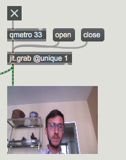

Now, you can see how we can use _jit.glue_ and _jit.scissors_ to mix these two matrixes together.

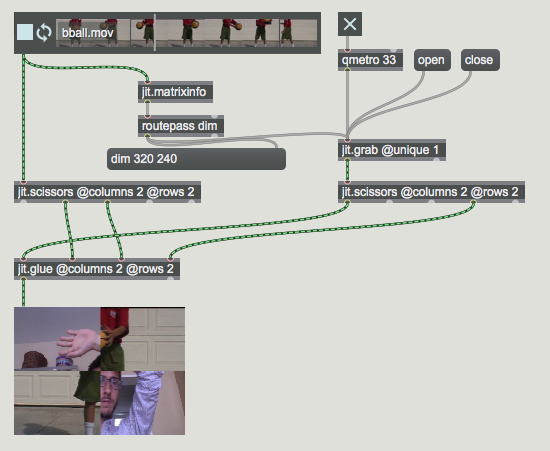

You'll notice that this whole thing doesn't seem to work at first, and Max doesn't exactly tell you why. The problem is that unless you set the size of the video explicitly, the dimensions of the webcam capture and of the video clip will be different. When _jit.glue_ tries to put the matrix back together, it fails because the pieces aren't of the right size. Jitter can scale up the video automatically, but you have to send it a _dim_ message followed by the width and height that you desire. Fortunately, it's easy enough to use _jit.matrixinfo_ and _routepass_ to get the dimension of the video clip.

Incidentally, this is a pretty common Jitter annoyance. If you see that you're having issues getting Jitter to work the way you expect, making sure that two matrixes have the expected dimensions and planecount is a pretty good place to start.

Alright, so scissors and glue works pretty well for mixing two matrixes together, but it's not all strawberries and cream. What if, for example, we still wanted to mix together two matrixes, but we didn't want to do it at the exact halfway point? We can't use _jit.scissors_ here, because this object always splits a video at the exact middle. So what do we do?

Enter our good friend _jit.gen_. What is gen? It's the greatest. Basically, it's a little subpatch that you write, that runs in parallel on each and every pixel in the image. (It has many flavors in the jitter world: _jit.gen_, _jit.pix_ and _jit.gl.pix_. Technically, _jit.gen_ is slower that _jit.gl.pix_, but don't worry about that for now.) How can we use this to make a "wipe fade" between two images?

Easy. Check out this patch and _jit.gen_ subpatcher.

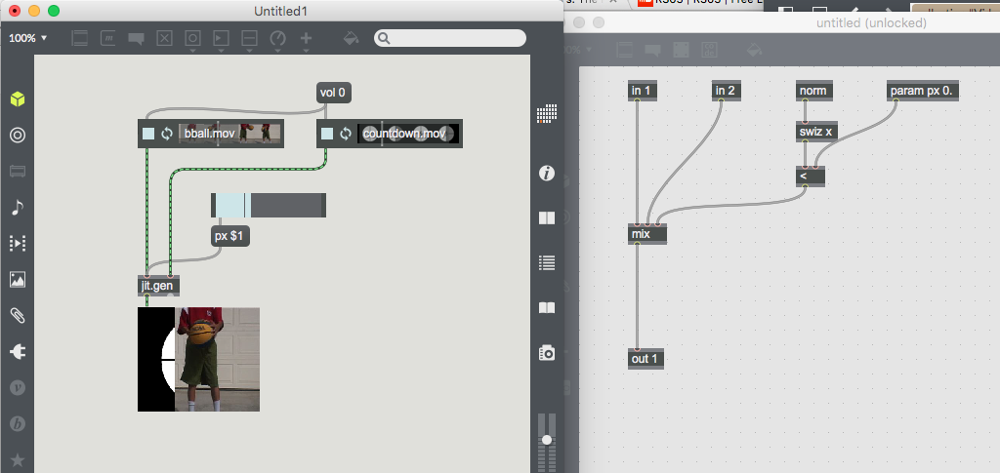

So what's going on here? Well, the meat is in the _mix_ object inside the _jit.gen_ object. First, I should point out that _jit.gen_ is kind of like a subpatcher, except it doesn't actually create another Max patch inside it. Rather, it creates a _gen_ patch, which uses a set of objects that are unique to _gen_. Try to make a _snapshot~_ object inside of _jit.gen_ and it won't work. Try to make a _mix_ object in the parent Max patch—it won't work either. The objects that you put inside of the _jit.gen_ object define its behavior.

Let's look at what's inside. The heart of this object is the _mix_ object. This takes input from _in 1_ and from _in 2_. These represent the pixel input from the left and the right matrix. I say pixel input because you have to think of this patch as operating on each pixel of the two incoming matrixes, one at a time. Now, the other input to mix is a value that specifies how much to mix together the two matrixes. Zero means use entirely the left matrix, one means use entirely the right, and values in between mix between the two inputs. So, if we want to wipe between the two matrixes, we just need to change this value depending on the position of the pixel. Pixels before a certain point need a zero, those after that point need a one.

To accomplish this, we need the help of a few special objects. The _norm_ object is similar to the _in_ object, except instead of containing the pixel value (alpha, red, green and blue), it contains the coordinates of that pixel. It will be (0, 0) for the top-left pixel and (1, 1) for the bottom right. Norm means "normalized", since these coordinates will always be between 0 and 1, no matter how big the input matrix is. 

Easy, so what's up with _swiz_? This is the pixel swizzling object. What is swizzling? Well, it's a bit like unpacking. Norm contains both the x and y coordinates, but here we're only interested in the x coordinate, since we're only dealing with the horizontal position. So, we use _swiz x_ to get just the x coordinate. Finally, we compare the x coordinate (which will be zero for pixels on the left and one for pixels on the right) with a param, a value we define that we can set externally. Using the slider back in the parent patch, we can now wipe between the two matrixes. Neat.

As an exercise, you might try to achieve the same thing, but using the y coordinate of the input matrix. And of course, instead of doing a wipe, you could just do a simple crossfade.

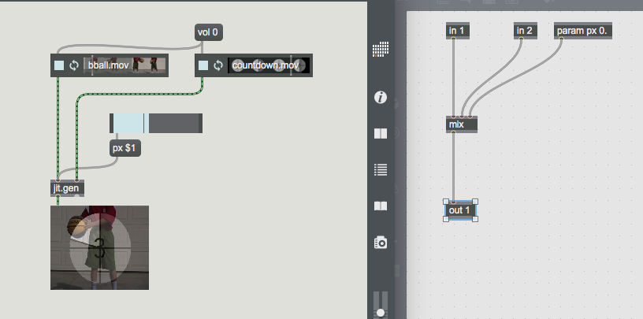

There's another exciting gen object that you should get familiar with, called _sample_. This object is similar to _mix_, in that it draws its input from a matrix of pixels. But what sample does is draw pixels from a new position, rather than a new matrix. The first input is a matrix of pixels to sample from. The second is where in that matrix to draw the pixel from. In the following configuration, _sample_ simply takes the input and passes it straight through.

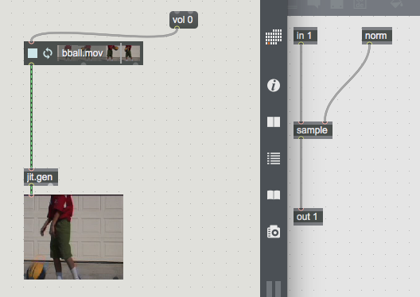

The simplest thing to do with sample is offset the sample position by some small amount. This has the effect of shifting the input matrix. 

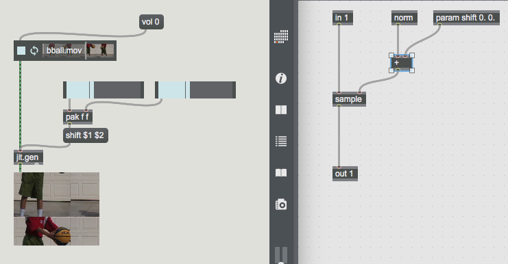

Note that the pixel values wrap around. Another neat thing that we can do with resampling involves the modulo operator. Didn't I tell you modulo was cool? You didn't believe me. What do you think happens, for example, if we scale up the matrix in x and y, but then take the modulo of the output. Why, tiling of course.

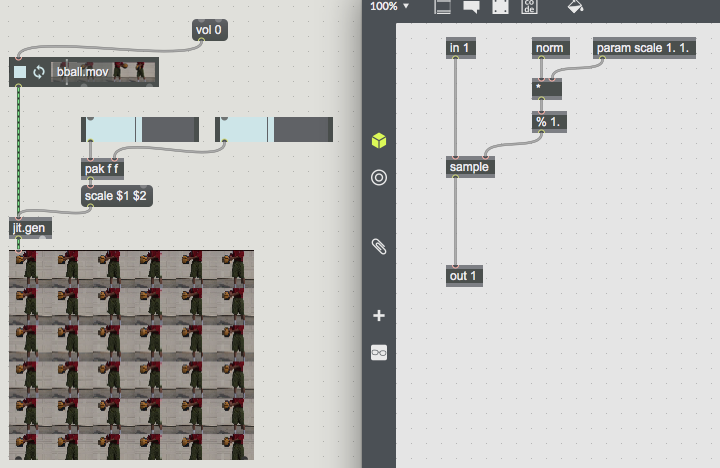

Anyway, that's just a brief introduction to all of the neat stuff that you know how to do now, using Jitter.

###ASSIGNMENT

Remember before where we made a musical accompaniment to a video using Max/MSP? Now's the time to make a video accompaniment to a piece of music using Jitter. You're free to use the same clips from the midterm assignment (assuming you've still got those lying around somewhere). Try to map your MIDI controller to the values you'd like to control in your Max patch, and make something that reacts to the audio as it plays. Oh, and you can use _jit.record_ to record the output. It should be easy enough to work it--just check the help patch.

