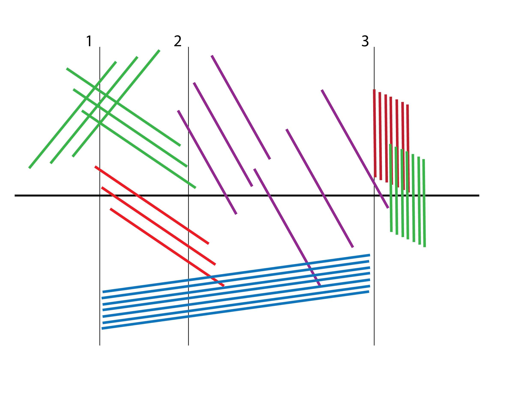

#LESSON 13 - IN-CLASS LAPTOP ORCHESTRA

No, seriously, one of the students made this patch. In class. How great is that?

###DESCRIPTION
Laptop orchestra. You know. Take the class, divide them into groups of about 3-4 people. I like to divide them into frequency ranges, saying "You four, you're responsible for everything under 200 Hz," etc. That way each group is sort of similar to an orchestral section, and it keeps the groups from stepping on each other's toes. You'll see in the "make assignments" patch that I also like to give each group a few objects/concepts that they must work with, as well as a color and an AOC cheese for inspiration. Why a cheese? I don't know, we're in France, it seemed funny to me.

###MOTIVATION
Why do a laptop orchestra? Probably at this point in the course, it's starting to get difficult for the students to sit still and absorb much more information, without taking the time to do a project. Also, getting them to work in a group encourages them to pool their knowledge. We've covered so much material that at this point it's inevitable that some students are starting to feel a bit left behind, so it makes sense to give the more advanced students an opportunity to help the others along a bit. Plus, doing a laptop orchestra means all of the patches have to be able to run in real-time. That means that they need MIDI/mouse+keyboard or whatever other kind of controls, and they need to be organized enough to be played live. It's a good dry run for the final concert piece.

###HOW-TO
You're the professor, so you do whatever you want. I like to say that we're going for a 12-15 minute piece, and Ode to Max in three movements. Then I outline the three movements.

The first movement is for M--the motivation of Max, the environment. The feel of the patchcords, the texture of the object box. The first movement represents the hope that you feel when you first look at a blank patch and dream about all the sonic possibilities you're about to explore.

Next comes the A, which stands for Academia and the knowledge behind Max. A is measured and exact, it's the ratio of two harmonics and the syntax of the coll object. 

Finally, in the last section we come to X. This X stands for the unknown and the unexplaned. The letter X is responsible when Max glitches out, or the signal turns to noise, or Max unexpectedly quits.

Next I run the make_assignments patch, and divide the class into groups. The patch is currently set up to split everyone into two groups, but you can adjust the patch to taste. After giving each group their color, required concepts and frequency range, I give them two hours to prepare. Then we have a rehearsal, and another 30 minutes to make final adjustments and to fix bugs. Finally we do the actual performance.

In the meantime, I try to make a graphical score using the colors that have been given to each group. Basically I go into Illustrator and mess around. The first year my score looked like this:

In this same folder, you'll also find a recording of that first performance. Enjoy!
