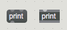
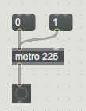
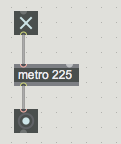
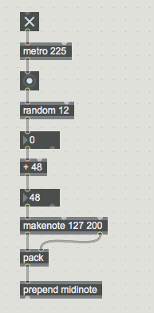
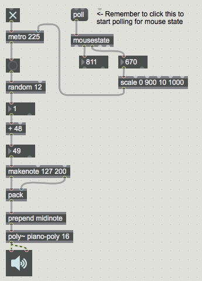

#LESSON 01 - INTRODUCTION

###Ice Breaker Thing
This is up to you. You’re a cool teacher, do some cool teacher stuff to blow some minds.

###Watch a bunch of youtube videos
I like to start off by watching a bunch of YouTube videos, to show off some of the cool stuff that can be done with Max. It's 2016, so people are really interested in YouTube right now. You can show whatever you want of course, but here are some suggestions:

- **Daito Manabe x Elevenplay** https://www.youtube.com/watch?v=zBm3mJiJzh8

- **Naoto Fushimi** https://www.youtube.com/watch?v=vjg-luytpUk

- **Leafcutter John** https://www.youtube.com/watch?v=aaqeHsY3yVY

- **Robert Henke** https://www.youtube.com/watch?v=e_alujkYBaE

- **Tarik Barri** https://www.youtube.com/watch?v=q-9LFup8r_g

- **Butch Rovan** https://www.youtube.com/watch?v=rS_zwFuOT_o

- **Modell 5** https://www.youtube.com/watch?v=ATWljMbvVTg

- **Alexander Schubert** https://www.youtube.com/watch?v=LqZNeDGmgVY

- **Andrew Spitz - Super Angry Birds** https://vimeo.com/46975682

###Max Basics
"Welcome to Max. Get pumped. If you've ever tried making music on a computer before, then no doubt you've encountered something that looked basically like Garageband or ProTools or Finale or Sibelius. In every case, you had a timeline and a bunch of tracks, and you arranged sound and notes on those tracks to make music. Max isn't like that. This new window that we've just opened (press command-N if you don't see such a window) is completely empty. There's no timeline, no time signature, no play button, nothing at all except for space. This is the empty canvas on which your dreams will come true.

"Everything in Max is an object. An object is a box that does something. For example, if you press the B key, you can create a button object. You can also make a button by clicking on this little button looking thing a the top, which shows you specialized buttons. But for now, try making a button. Notice too that you can click and drag this button to move it around. You can drag the bottom right corner to resize it as well. Alright, enough moving the button. Now, try locking the patch by pressing command-E. You can also lock the patch by clicking the lock in the bottom-left of the patcher window, or by navigating to View->Edit. I don't think anyone does that last one. Anyway, if you click on the button now, you'll see that it flashes. This is the only difference between a locked and unlocked patch. When the patch is unlocked, you can select, move, create and delete objects. When the patch is locked, you can click on objects to interact with them. That's the only real difference.

"Alright, unlock the patch again, and make another button object. Now, hover over the first button, and you'll notice a little green circle appear over the bottom edge of the button. This is called an outlet. Most objects have at least one inlet or outlet. Drag from the outlet of one button to the inlet of the other to create a patch cord. Now try locking the patch and clicking on the first button. You'll notice that it flashes as expected, but the other button flashes as well. Fascinating. Now you're starting to see why Max is such a revolutionary program.

"Most of the time (and we'll definitely see some slightly confusing exceptions later) this patch cord defines where a message goes when an object generates it. This is what's happening in our patch: clicking on the button causes it to output a message. The patch cord defines where that message goes: from the first button to the second. The second button receives the message, and in response it does something: flash and output its own message. If you get this, then you've basically grasped the whole of Max. It's all just objects sending messages to each other, and doing something in response.

"We said that the first button is sending a message to the other button, but what is that message exactly? There are two main ways to view the contents of a message. The first is to use a message object. You can create a message object by pressin the M key. This will make a little gray capsule. If you hover over it, you'll see that the capsule has one outlet and two inlets. Make a patch cord connecting the outlet of the button to the _second_ inlet of the message object. Now, when you lock and press the button, you should see the word _bang_ appear inside the message box. That's because, when the message box gets a message at its right inlet, is fills itself with the contents of that message. What happens when it gets a message in its first inlet? We'll talk more about that a bit later.

"The second way to see the contents of a message is to use the print object. Unlock your patch, and now press the N key. This will make a dark gray rectangle with a lighter gray top and bottom. This is called an object box. So far all of the objects that we've looked at (all two of them) have been what's called UI objects–user interface objects. That means they have a particular look, and they respond to user interface actions like clicks. Most objects are not like this. Most objects just look like this generic rectangle, where there specific identity and behavior is defined by their name. Anyway, try typing into your object box the word _print_. This should result in an object with exactly one inlet: a print object. If you connect the output of the button object to this message, lock the patch and click the button, the print object will print the contents of that message to the Max console. Where is the Max console? It's in the sidebar of your window, and you can open it up by pressing command-M. Do so and you should see the bang message there.

"Alright, two quick things I want to mention. First, message boxes and object boxes are not the same. You could be forgiven for thinking they were: one is a dark gray rectangle, and the other is a dark gray rectangle with slightly rounded corners. 

 These two are not the same

"One of these is a print object. The other is a message object that contains the message _print_. It's a distinction that's a common source of confusion for people who are new to Max. The other thing that I want to point out is a tip: you don't have to lock your patch to interact with it as if it were locked. You can command-click to activate buttons and move sliders as if the patch were locked. It's a hand shortcut that you might want to practice.

"Alright, so, buttons, messages, consoles, who gives a shit? Let's make some sound. Let's press the N key again to make a new object, only this time let's type the word metro into the object, followed by a space, followed by a number. Let's start with a number like 225. Now, make two message boxes. Fill one of them with a 1, and the other with a 0. Connect both of these to the metro object. Finally, create another button, and connect the outlet of the metro object to the button object. You should have something that looks like this:

"Now, lock your patch and press the 1-message. This should start the button under the metro blinking. Basically, metro is like an auto-button. It sends out a bang message, just like the button, only it does so at a regular interval. In this case, that interval is once every 225 milliseconds. You can click on the 0 message to stop the metronome. Neat. Instead of the two messages, you can also use an object called toggle. Unlock your patch and make a toggle object by pressing the T key, and connect it to the metro object. Now, you can flip the toggle on and off to control the metronome.

"There's something slightly confusing that I'd like to point out here, which is that the toggle doesn't necessarily reflect the state of the metronome. So, try this: The metronome is on now, right? It's sending out bang messages at a steady rate. Now, try disconnecting the toggle, and turning the toggle off. Notice that the metro stays on. Confusing? Get ready for something even more confusing. Now try conecting the toggle (still off) to the metronome again. Now the the toggle is off, but the metronome is still blinking. What's going on? Well, the thing is, the toggle works like this. When the toggle is off, clicking it turns the toggle on and sends out a 1 message. When the toggle is on, clicking it turns the toggle off and sends out a 0 message. The metro responds to those 1 and 0 messages, not to the state of the toggle. That's it. The metro and toggle don't actually know about each other, and the state of the toggle doesn't necessarily reflect the state of the metro. Alright, honestly it's not that confusing, but I wanted to mention it.

"Anyway, cool, so we've got a bunch of regularly spaced bang messages. What now? Well, maybe we could try generating some random numbers. Make another object, type in _random 12_. This creates an object called random, which will output random numbers in a specific range. In this case, whenever it gets a bang, it will output a random number that can be as low as zero (inclusive) and as high as 12 (exclusive). If we wanted to see this number, we could use a message box. We could also use another new object, called an integer box, which displays whole numbers (numbers without a decimal component). You can make one of these by pressing the I key.

"Now, suppose we didn't want numbers between 0 and 12, but between 48 and 60? We could simply take the numbers coming out of the random object and add 48, right? So let's make another new object, and type into it _+ 48_. This is called a plus object, and it simply adds to whatever number comes into it. We can add another integer box after this plus object to see what's coming out.

"Alright great, we've got random numbers. Let's make some goddamned sound already. We're going to make a few more objects here without really worrying too much about what they are or how they work. The first is called _makenote_. Create a new object, and type into it _makenote 127 200_. The first argument is the velocity, or the loudness of the MIDI note (a number between 0 and 127--more on this later). The second is the duration of the note, in milliseconds. Next, make an object called _pack_ and connect the second outlet of _makenote_ to the second inlet of _pack_, and the first outlet of _makenote_ to the first inlet of _pack_. Now, make an object caled _prepend_ and give it the argument _midinote_, so that the object is filled with _prepend midinote_. So far, you should have this:

"Next, make an object with the following in it: _poly~ piano-poly 16_. The little squiggle after the word poly is called a tilde; you'll find it next to the 1 key. Finally, _finally_, you can make an object called _ezdac~_. After you make this object, it should turn into a little speaker looking icon. Connect the outlet of _poly~_ to each of the two inlets of the _ezdac~_ object (one for the right and one for the left channel. And now, drum roll, you can lock the patch and click on the _ezdac~_ object to turn on DSP (sound processing). And you should hear some very, very satisfying piano sounds."

###Adding some controls

"So far, we've succeeded in making a whole bunch of random notes. Are we happy with that? Have we done enough? Listen to what's coming out of the speakers right now. Does that sound like music? Does it? No, it sound like trash. We're better than that.

"How many pieces of music do you know that have exactly one note duration? Obviously, we want to be able to vary the tempo that we're making random notes at. You may notice that the metro object has a second inlet. We can use that inlet to control the tempo of the metro object. Any number received in that inlet will control the millisecond duration between bangs coming out of the metro object. Smaller numbers speed the metro up, larger numbers slow it down. Try creating an integer box and connecting it to the metro object. With the patch locked, you can drag up and down in this box to change the tempo. You can also click once inside it, then start typing to specify a particular tempo. Try setting it to zero. Notice how great that sounds. Also, notice that even though you've changed the number going in here, the first argument to metro is still 225. That's because the 225 number is just an argument. It defines the initial state of the metro object. If you save the patch, close it and re-open it, the metro will have a tempo to 225, but if you change it thereafter the 225 doesn't really mean anything anymore.

"Maybe you'd like more exact control than a box that you click and drag inside. Maybe youd like to live in a world where you could simply move your mouse up and down, and the object would adjust tempo accordingly? For that we can introduce another object, called mousestate. This object reports the vertical and horizontal position of the mouse. Hovering over each of the outlets will show you which is which. The _mousestate_ object is inactive by default, but it activates once you send it the _poll_ message. Now for me, the vertical coordinate of the mouse goes from 0 to 900. Before connecting this to the input to my metronome, I might want to scale this to be in a new range. Fortunately, the perfect object for this exists: it's called _scale_. Scale takes four arguments, the first two defining an input range, and the second two defining an output range. Think about it this way: the first two numbers are the numbers you're getting in (0 to 900 in this case) and the second two are the numbers you'd like to get out (say 10 to 1000 for tempo). So, I could use a _mousestate_ and _scale_ object like so to control tempo:

"Does this sound like music yet? Not really. So there's something worth mentioning about this random object. Random number generators in a computer aren't really random. They start with a random value, called a seed, and then generate a sequence that is very, very hard to predict but is actually a deterministic pattern. So, if we give the random number a particular seed, it will always generate the same pattern over and over again.

"Try making an object called _counter_. This object is like random, in that it generates a number every time it gets a bang. However, the difference is that it always counts up. If we give it an argument, say 7, then it will count up to that number and then reset to 0. Then we can use an object called _select_ with the argument 0 to send out a bang only when the counter is at zero. Finally, we can reseed our random number generator whenever this value is reached. And now we have a repeating pattern.

"Does this sound like music? Actually, kind of. Isn't that wild? It's just a repeating sequence of random notes, played with no articulation or phrasing, but it does kind of sound vaguely musical. And so, we come to the first fundamental rule of music:

####FUNDAMENTAL RULE OF MUSIC #1: If it repeats, it's music

"Let's try recording some music. In the Extras menu there's an option called Quickrecord that you can use to record the output of your patch. Get good at using this because we're going to be using it every single day to record our patches. Basically, you can pick a file (or directory) to record to, then start recording. 

###ASSIGNMENT:
Make a recording. Aim for a one-minute "piece" that you perform, using the mouse to control the tempo of your random note generator. If you find that this isn't enough expressive potential, consider the following:

- The horizontal axis of your mouse position is completely unused. What's up with that? What could you control with that? Maybe the loudness of each note, or the offset?
- So far we're using just one seed, but you could use more, right? Then you'd have two or more random patterns to work with. How could you switch between them?
- Right now there's only one metronome and only one piano note generator. But if you select a whole bunch of objects, you can copy-paste them, and then you have a whole nother set of objects. Just saying.
