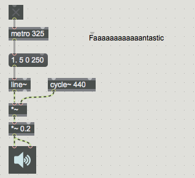

#LESSON 02 - WHAT IS SOUND?
###What is sound, anyway?
No seriously. It's not incorrect to say that sound is vibrations in the air, that resonating physical objects create a pressure wave that causes vibrations on the tympanic membrane, which is coupled to a fluid in the ear that stimulates nerve endings that resuls in a sound perception inside the brain. Sure, yes, that's all true. But when we do computer music type stuff we're often concerned with the properties of sounds. Take a listen to this sound, for example:

**\<play sound of glass breaking\>**

What happened here? How do you know? How do you know that it was a particular material and not another? When you listen to a sound, what are you able to pull out of it?

- What materials are involved
- How those materials interact
- Is the material deformed
- Did one material break
- How many objects are involved
- How much force was involved
- Is the sound getting nearer or farther
- Is the sound moving
- Where does the sound take place

The sound that an object makes when you hit it is determined by the physical properties of that object. This is a picture of a Chladni plate: a metal plate that can be clamped at various positions before being vibrated by an external sound source. Parts of the plate move up and down while the plate vibrates, but other parts remain still. We can visualize those parts of the plate that remain still by sprinkling sand on the plate. The exact pattern of these still parts of the plate is determined by the properties of the object, including its material composition, shape and thickness. All this to say that people are incredibly sensitive to this stuff. 

Let's take a look at some sounds. First let's look at some speech. This is a recording of me reading the test sentence "Hello, my name is Sam". Now hopefully, this kind of image is something that you've seen before:

This is called a spectrogram. It shows you the sound broken out into its various frequency components. You can think of it a bit like (or really exactly like) what happens to light when it goes through a prism. The X axis is time, the Y axis is frequency, and the color is how much energy is present at that frequency and time. One thing that's really nice looking at a graph like this is you can see very clearly the vowels and the consonants. Vowels have this nice stripey pattern to them, which is because vowels are what's called harmonic sounds. Consonants on the other hand are noisy sound.

What is a harmonic sound? Most of the sounds that we use in music are harmonic sounds. These sounds are typically produced by something simple vibrating, like a string. They are characterized by having strong frequency components at evenly spaced intervals, which cause the stripes in the spectrogram plot that you see above. The spacing of the intervals is what determines the pitch. The lowest harmonic frequency component is called the fundamental, and the others are called harmonics or partials. For sounds with a very clear pitch, the harmonics will be related to the fundamental by a simple whole-number ratio. To see why, take a look at this image, which shows the modes of a vibrating string.

Just because a sound has a vbrating character to it doesn't mean that it will necessarily be harmonic or have a clear pitch. There are in fact what are called inharmonic sounds, which have strong partials but where the partials are not related by a simple ratio. A bell sound, for example, has partials like this. 

###Enough theory

So this is cool and all, but let's make some sounds. The simplest way to make a sound in Max is with the _cycle~_ object. This object generates a sine tone with a particular frequency. You may have hear it last time you were at the doctor having your hearing tested. Let's listen to a sine tone now. Try making a _cycle~_ object and giving it the argument 261.6. Now, before we play this very piercing and annoying sound directly out of our computer speakers at full volume, let's try attenuating the sound a bit. That means to change its volume. We can change the volume of a sound in many ways, one of the easiest is simply to multiply it by some value. Try making an object called _*~ 0.2_. We saw yesterday that there was an object called _+_ that would let us add two values together. There is of course also a _*_ object for multiplying two objects together. Many of the objects that work on messages have a counterpart that works on signals. What are signals? Well, you may have noticed that when you start to drag a patch cord out of this cycle~ object, it doesn't look the same as the patch cords that you drag out of other objects. That's because messages don't run along this patch cord, but audio, aka a signal. Anyway, the _*_ object works on messages and the _*~_ object works on signals. So, if we take the output of the _cycle~_ object and multiply it by 0.2, we get a singal that has one-fifth the amplitude of the original _cycle~_ object. Now, this is safe to connect to an _ezdac~_ object like we did yesterday, and we can listen to the output. 

Making a sine tone is nice and all, but it sounds really static and pretty uninteresting. Most sounds that we encounter in the real world of actual things have some shape to them. You play a piano note, it starts out really loud, but then it becomes quieter over time until slowly it fades out entirely. This pattern of loudness and softness of a sound is called its envelope. A big part of why pianos sound like pianos and flutes sound like flutes is because one has a very sharp attack and the other a very gradual one. One simple model of an envelope divides it into four parts: the attack, decay, sustain and release.

More on that later. For now, we already saw how we can attenuate the loudness of a sound by multiplying it by a number between 0 and 1. We can use this technique to generate an envelope. Let's make a new object called _line~_ This is a ramp generator object. In response to a message, it will start outputting a continuous ramp from its current value (defaults to zero) to a new value over the specified time. For example, if you sent it the message (1 1000), it would ramp to the value 1. over the course of 1000 milliseconds (also known as a second). Try connecting messages to your _line~_ object so that you end up with something like this:

We've been sending _line~_ a two-element message, but in fact you can send _line~_ a message with any number of pairs of elements, and it will interpret the whole thing as a series of values to go to over given durations. For example, the message (1 5 0 250) means go to 1 over 5 milliseconds and then go back to zero over 250 milliseconds. If you send _line~_ this message, then just listen to the cute little tone that you can make. Try connecting a metro object to the message going in to _line~_ similar to the way that you did yesterday. You should end up with something like this:

We saw before that different sounds have characteristic timbres that depend on the particular spacing of their harmonic components. A sound is harmonic if each partial is a whole-number multiple of the fundamental. This gives us a pretty easy strategy for generating harmonic sounds with Max: we take the frequency of our fundamental, and we multiply it by 2, 3, 4 etc. to get the frequency of our other partials. Try it now and you should end up with something like this:

Of course, just because we're told to multiply this fundamental by a whole number, doesn't mean we have to. If we feel like being crazy rebellious, we can use non-whole number multipliers to achieve a weird, metallic timbre. There's another interesting thing that we can try, which is to set two of our multipliers very close together. If, for example, we make one of the multipliers 1.1 and another 1.01, then we actually end up with amplitude modulation as the two sine waves move in and out of phase. We can bring more than one of the multipliers close together to achieve even more complex rhythms.

Now, I've put off talking about it as long as possible, but unfortunately we've got no choice now but to talk about hot and cold inlets. Something that you may have noticed at this point is that when you change one of the multipliers, you have to send out the fundamental again for the change to be propagated. This is because, as you can reveal by hovering over the inlets to the _*_ object, the right inlet is "cold". That means that putting a new value into the right inlet won't actually send out a new value. All it does is change the value by which the left inlet will be multiplied before it is sent out. There are a few ways to fix this. The easiest one is to use the _pak_ object. We already saw _pack_ in the last lesson, even though we really didn't talk about it. Basically, it packs the values that it receives together into a list. A list is just a series of ints, floats or symbols.

The big difference between the two is that all of the inlets to _pak_ are hot, so we can use _pak_ to make a multiplier that will update when either the left or the right value is changed. Oh, but we have to give it the arguments f and f. Why? Because _pack_ and _pak_ also format their output automatically. That means that they will force their values to be of a certain type. By default that type is integers, so _pak_ will automatically trim floats to ints if we don't specify that we'd like our inputs formatted as floats. Hence, _pak f f_.

###DOLLAR DOLLAR BILLS

You know what else would be super cool? If we could somehow change the slope of our line~ object. What if we'd like a really slow attack, or a super quick decay? We can change the values inside the message box that's going into line~, but that would mean that every time we wanted a different envelope we'd have to unlock the patch and type in a new value. 

The secret here is to use the $ notation inside of the message box. We've already seen that a message box can hold a number of values in a list. But some elements of that list can be placeholders that will be filled in when the message box receives a message in its right inlet.

We can use this with a pak object to update the shape of our envelope on the fly

###ASSIGNMENT

Take what we've done so far, and use Quickrecord to make some samples. Try experimenting with different timbres and different root frequencies. You can also try changing the speed of the metro and the shape of the envelope. Once you've made a whole bunch of recordings, try arranging them in a DAW of your choice. You can use Garageband, Logic, ProTools, Live, Audacity or whatever. Honestly you shouldn't need anything more complex than Audacity. Aim for a piece that actually sounds like a piece, of about 1:30 in length.

###MODULATION

So we've seen that you can get a sine tone, and that you can multiply it by the output of a line~ object to control its envelope. If you're like me, then you've got to be wondering, what happens if we multiply the output of a sine tone by a rapidly changing number? What if we multiply it by, say, another sine tone? When one of the sine tones is at a low frequency, you'll notice an effect that sounds like tremolo, where the loudness of one of the two sine tones is increasing and decreasing rapidly. As you gradually increase the frequency of this oscillation, you'll hear the amplitude changing faster and faster, until it becomes a kind of buzz. As you increase the frequency even more, the buzz will disappear, and in its place you'll start to hear two distinct tones. Congratulations: you've just discovered amplitude modulation.

Strictly speaking, there is a difference between amplitude modulation, where the output of the modulator never crosses zero, and ring modulation, where the modulating waveform is centered at zero. If we bust out the _spectroscope~_ object, we can see the difference between the two. Both create sidebands, but only amplitude modulation leaves the original waveform intact. It's worth mentioning that since we're in Max 7, we also have access to the BEAP objects, which while we won't cover in this course are definitely work diving into if you're at all interested. In particular, in the Scope catergory, there's a module called Spectrum and one called Big Spectrum. In my humble opinion, these are much nicer than the _spectroscope~_ object.

Now, if you're super curious you may have noticed that not only can you multiply two waveforms together, but _cycle~_ has a signal input as well. We could use this to change continuously the frequency of a _cycle~_ object. But we could _also_ use it to modulate the frequency of a _cycle~_ object using another _cycle~_ object. Wow isn't that incredible? If we set this up in basically the way you'd expect, the result is an effect/synthesis technique called Frequency Modulation, first discovered by John Chowning in 1973. 

Typically, we don't set the frequency of the modulator directly, but rather set the ratio of the modulator to the carrier. This is called the Harmonic Ratio. Also, we usually make the amplitude of the modulator depend on its frequency. The ratio between these two is called the Modulation Index. These three control parameters make up the most typical arrangement of Frequency Modulation synthesis