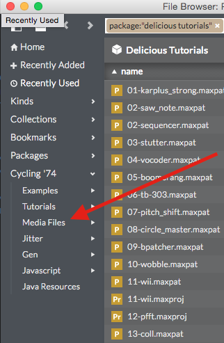
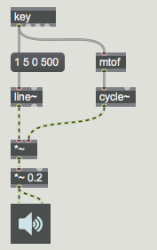
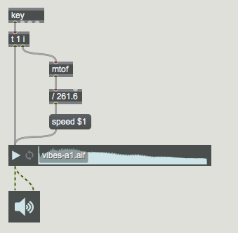
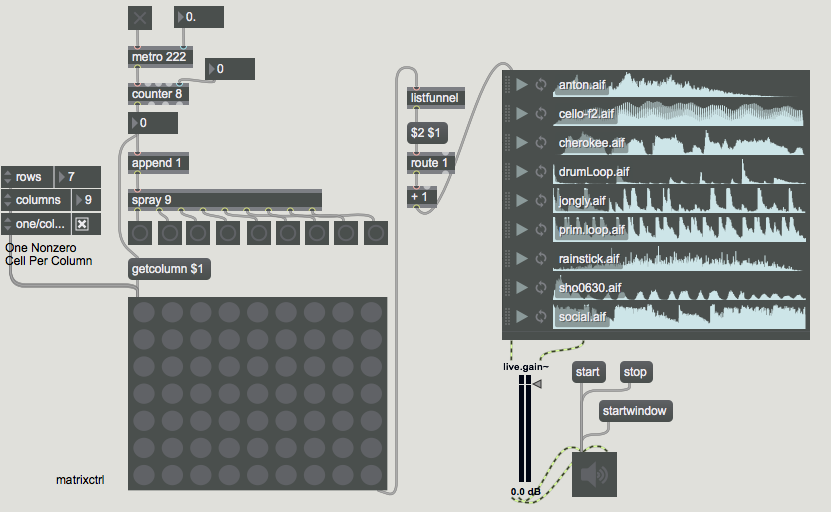

#LESSON 03 - SAMPLING
###Playing a recorded sound
Last time, we looked at how to make sound from scratch, using oscillators. Of course it's technically possibly to synthesize any real-world sound using only sine tones added together. But probably this isn't something that you have the time or the inclination to do. Instead, you might want to work with sampled sound. 

The simplest way to get sound into Max is using the playlist~ object. Before we can do that, we're going to talk a bit about the file browser in Max. Go ahead and push command-B. This opens up the file browser. I did some work on the design of the file browser, so if you hate it then I understand. Now, on the left you'll see a bunch of Categories, things like Kinds, Collections, Bookmarks and Packages. There's also one called Cycling '74. Go ahead and click on this, and you should see a sub-category called Media Files.

Click this, then click on Audio Files. Congratulations, you're looking at all of the sounds that come build in with Max. All 12 of them. Anyway, try making a new patch, then dragging one of these sounds into it. You should see a _playlist~_ object appear, which looks like a waveform with a little play button. Try connecting this to an ezdac~ and pushing play. You should hear your sound.

Now, using Cycling '74's built in sounds is cool and all, but what if you want to use your own sounds? Then you'll need a collection. So, at the bottom of the browser in the bottom-left, you'll see a plus button. Click that, then click "New Collection". Now, you can drop your own sounds in here, and then drop those sounds into Max. 

To remove a sound from the _playlist~_ object, you must lock the patch, then right click inside the playlist and select **Remove** to remove the clip.

The _playlist~_ object will not only play back sounds for you, it can also play back those sounds at different speeds. Try sending the playlist~ object a message like "speed 0.5". What does it sound like? Now try sending it the message "speed 2". What does that sound like? Using just this technique, we can make the _playlist~_ object into a simple but effective sampler. To do that we need to talk about a new and exciting object--the _key_ object. This object sends out a message whenever you press down a key. The number that comes out of _key_ corresponds to the ASCII value of that key. Interestingly, the ASCII value of the character '1' is 49. The ASCII value of the spacebar is 32, and the ASCII value of the escape key is 27.

If you recall the very first lesson, we used an object called poly~ which accepted MIDI notes. The note values that we were sending to that object were basically in the range of 48 to 60 or so. You didn't see it, but inside the poly~ object that I was using to play MIDI notes in that patch, there was an object that converted those MIDI note values to frequency values. MIDI note 60, for example, maps to middle C at 261.6 Hz. If we want to play notes, we need to convert our ASCII values to frequency values. Fortunately, there's an object that can do this for us. It's called _mtof_ and it converts midi to frequency. Neat, right? So using a stack like this, we can make a synthesizer that plays sine tones.

The cool thing to do, however, would be to re-pitch our sample to sound like the note we want to play. But we can't just tell our _playlist~_ object that we want to play back sound at a particular pitch. We can only tell it the speed that we want it to play at. So what do we do? The quickest and dirtiest solution is just to pretend that we know the pitch already. Let's just say that the pitch is 220 Hz, for example. Then, if we want to play the sound at 440 Hz, we'd just play it back at double speed. 

Now, the last thing that we need to worry about here is order. We've finally come to the last thing in Max that I don't really want to talk about but have to talk about eventually: right to left order. When an object sends out a message, we already know that it goes to all attached objects. But in what order? We can use a print object to see the order that it's going in--the answer is right-to-left order. Now, this is important to us because we want to set the speed that our _playlist~_ object is going to play at before we start it playing. How do we do that? We use an object called _trigger_. This object is very similar to _pack_ in that it formats the message that comes through it. After formatting, it sends that message out of the specified outlet, in right-to-left order. So, using a trigger object, we could realize our sampler in the following way:

###CURVES

Last lesson we looked at how to make a sampler by combining a line~ object with an oscillator. We can use a similar idea here with the playlist~ object to make some interesting stuff happen. For example, who says that we have to play our sound back at the same speed all the way through? In fact, we can make a pretty interesting record-player-stopping sound by using variable speed while we play back our sample.

In fact, now's probably a pretty good time to talk about a couple of other important curve objects. We've already almost talked about the _adsr~_ object. This is the classic attack-decay-sustain-release object. There's also the _curve~_ object, and the _function_ object, a personal favorite.

###SEQUENCER

The cool thing to do, however, is to select more than one of these sounds at a time. That's what the really cool kids are doing. Then when you drop this into Max, you'll get something that looks like a bunch of sounds stacked on top of each other. This is what the _playlist~_ object is all about. You may also notice that you can select particular regions of these samples to play back by clicking and dragging within the playlist object. You can also turn looping on and off by clicking, of course, the loop button. 

So. Let's do the thing that we were born to do. Let's embark on a journey where we try to build a sequencer. We've already seen how a metronome and a counter can work together to produce a series of numbers. Now, how do we use these to read a sequencer?

The trick is to make use of this object called _matrixctrl_. Take a look at the help file: you'll see that it defines a bunch of cells, each of which you can toggle on and off. We'll use our counter to read through these to create a sequence. The only tricky part is massaging what's going into and coming out of _matrixctrl_, so that we can use it to control our _playlist~_ object.

First, converting the counter to something _matrixctrl_ can use. This part is easy: we can option-click on the inlet to _matrixctrl_ see all of the messages that it accepts. One of them is called _getcolumn_. If we add a number after this, then we can read back the contents of a column out of the right outlet to _matrixctrl_. The tricky part is turning that list into a single number that we can send to our list object. What I'm going to do is use an object we haven't talked about called _listfunnel_, which takes a list and spits out each element of the list, tagged with its position in the list. I'm also going to use an object called _route_, which forwards lists tagged with a specific symbol to an associated outlet. When you put all the parts to gether, you should get something that looks like this:

###ASSIGNMENT

An ostinato is a fancy name for a loop. It's time to build a piece entirely out of loops, which you will layer by fading them in and out. Use whatever samples you want, with as long or as short a loop as you want. Fade the samples in and out with line~, curve~ and function objects. If you like, you can also try changing the speed of the samples, or their loop points as they're playing back. Save your patch and output your sound using Quickrecord. 