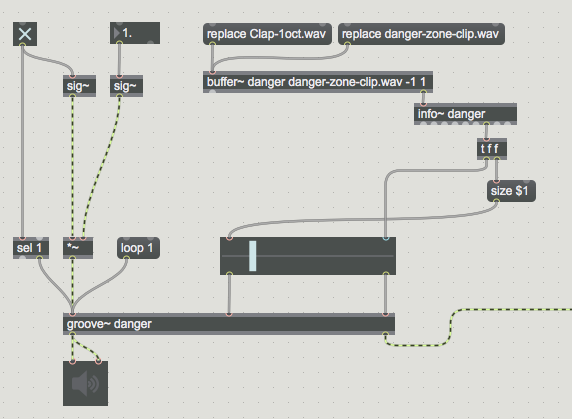
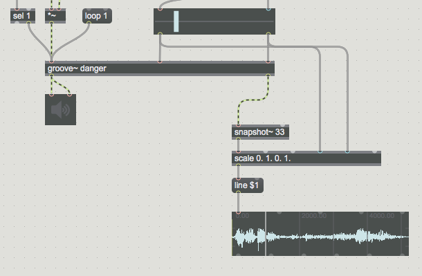
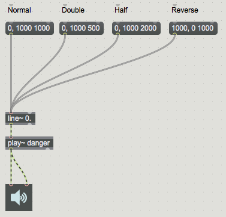
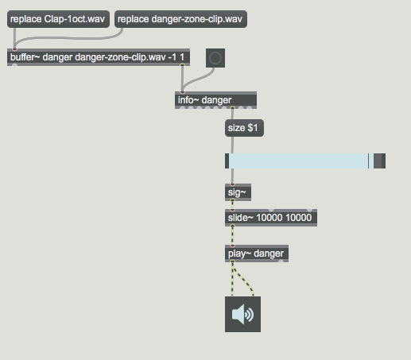
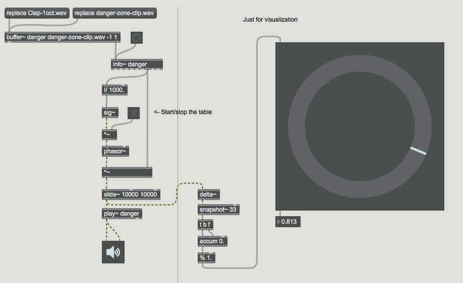
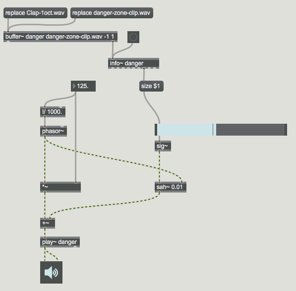
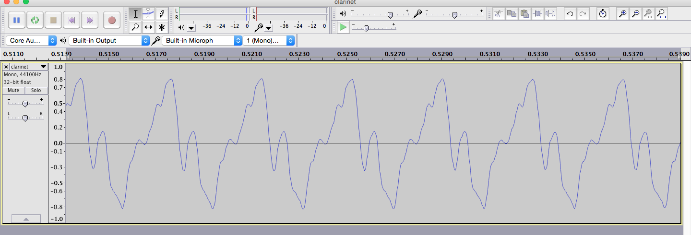
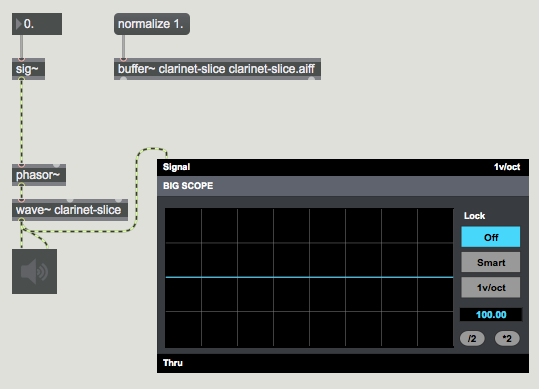

#LESSON 04 - SUPER PRO SAMPLING
### BUFFERS
Alright cool so last time we looked at playing back samples using the playlist~ 
object. This is definitely the easiest way to play sound in Max. However, if you want to be really cool then you want to start to learn how to deal with the _buffer~_ object.

This object stores a bunch of audio (well usually audio data, but it certainly doesn't have to be audio data...) in The _buffer~_ object is slightly different from most of the objects we've been working with so far, in that it doesn't actually need to connect to any other objects to work. Instead, objects that work with the buffer reference it by name. For example...

###PLAYBACK WITH _GROOVE~_
Cool so say you want to play back a sound stored in a buffer. The first thing that you need to do is get some sound into that buffer. There's a few ways to do this. The first and easiest is to send your buffer the _read_ message. This will fill the buffer with the contents of a particular file. If you send it the read message without anything in it, then you'll get an open file dialog. If you send it the read message with the path to a file in it, then hopefully Max will actually be able to find the file. Definitely remember that you can press command-M to check the Max console whenever you feel the need. This is well important, especially if your file doesn't seem to be working. Once you think your buffer is loaded, you can double-click on the _buffer~_ object to see its contents.

Now, let's talk about arguments to _buffer~_. The first argument is the name of the buffer. The second is the name of the file that you want the buffer to load when it's created. The third is the duration of the buffer, in milliseconds. Finally, you can set the number of channels in the buffer. Now, all of this can change when you read in a sound file. Before, we used the _read_ message to read audio into a buffer. However, you can also use the _replace_ message, which erases the contents of the buffer and replaces it with whatever file you load, changing both the size of the buffer and, potentially, the number of channels.

Anyway, once you've got your buffer loaded, you're probably going to want to play it back. The easiest way is with the _groove~_ object. As mentioned before, groove takes the name of the _buffer~_ object as an argument. Note that this is **not** the name of the sound file, but the name of the buffer. Other than that, _groove~_ is pretty simple. You send it a signal that specifies the speed at which you want it to play back (technically something called the sample increment, but don't worry about that). Then it plays back at that speed. Neat.

So what are some cool groove~ tricks? Well, it can loop, which is nice. You just need to send it the _loop_ message with a 1 to start it looping, and a 0 to stop it looping. You can also set the loop start and end points, which can be useful. If you want to set the start and end points of this loop object, then the _rslider_ object can be your best friend. Here's a picture of how to use an _rslider_ object with an _info~_ object to set the loop points of your _groove~_ object.

Something else worth mentioning is that the rightmost outlet of the _groove~_ object is a synchronization outlet, meaning it outputs a signal between 0 and 1 as the groove object plays through its section of the buffer. This can be used in a bunch of ways, particularly with the _waveform~_ object.

###PLAYBACK WITH PLAY~

Another even cooler object for playing back sound is the _play~_ object. This object is very similar to _groove~_, except you have to move the playhead manually. What does that mean, exaclty? Well, think of the input to the _play~_ object as the playhead position. In order to play back a sound, you specify where the playhead should be at any given time. The _play~_ object will output the sample at the appropriate position. Say for example you wanted to play back the first second of a buffer. You could do something like this:

By changing the destination and duration of the line~ ramp, you can change the speed of playback. You can even play backwards, which is neat. What I particularly like about the play~ object is how easy it is to do scrubbing type effects. Here's a very simple scrubber, turntable simulator and also a looper type thing.

### WAVETABLE SYNTHESIS
Something you might have noticed that's pretty interesting, is that when the size of the loop gets really really small, you end up with this sort of buzzing tone. That's because the loop is playing so fast, that is actually acts more like a single phase of a harmonic sound source.

Take for example this sample of a clarinet. If you open it up in Audacity and zoom way way in on the waveform, you can see the shape of a single period.

Neat. So the neat thing about each period of this waveform is that it contains all of the frequency components of the clarinet in all of the proportions of the original instrument. Wouldn't it be nice if we could make use of that, somehow? Well, try this. Go into Audacity, select a single cycle. Make sure that the start and end points line up correctly by pressing the Z key, which aligns the selection to zero crossings.

Now, back in Max, load that cycle of the waveform into a buffer. Now, we're going to use an object called _wave~_ to treat that single cycle of a waveform as a wavetable. Then, we'll use a phasor~ object (very much in a similar way to how we used it with the _play~_ object) to make a wavetable synthesizer.

You can also use two waveforms with equal power crossfade to morph between two timbres.