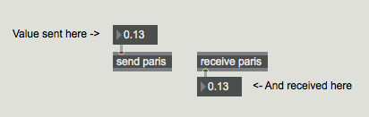
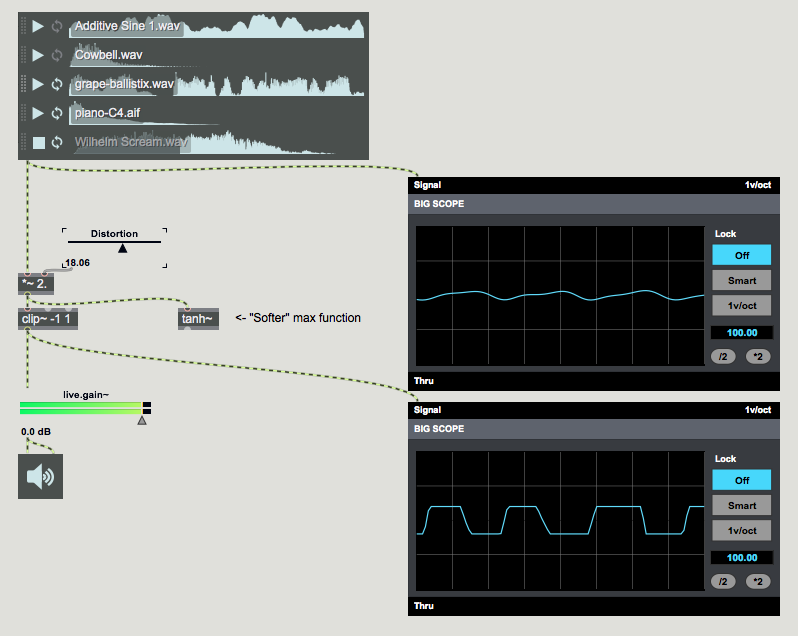
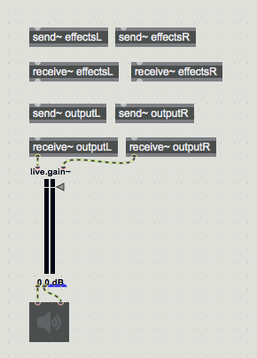
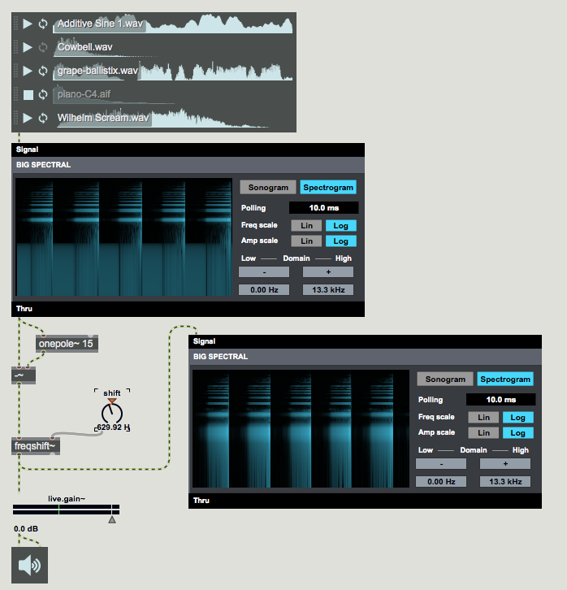
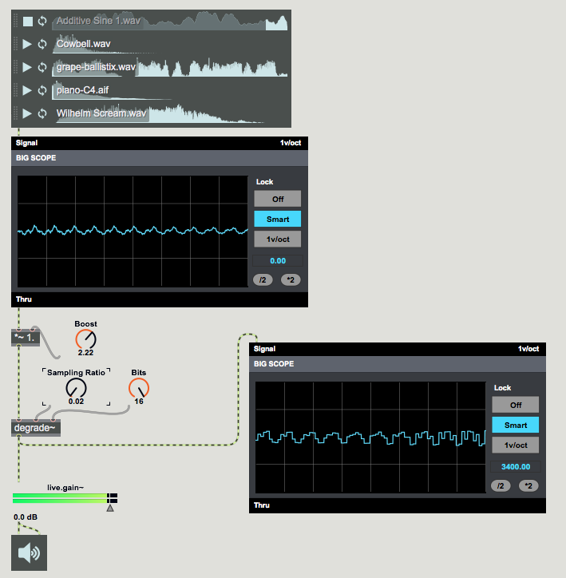
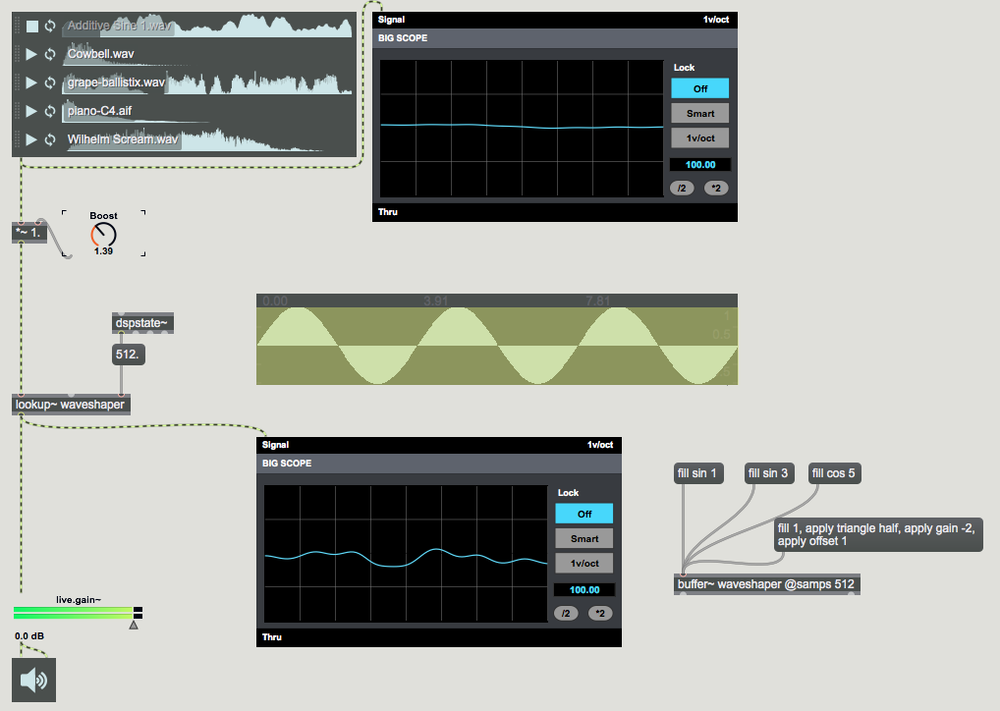
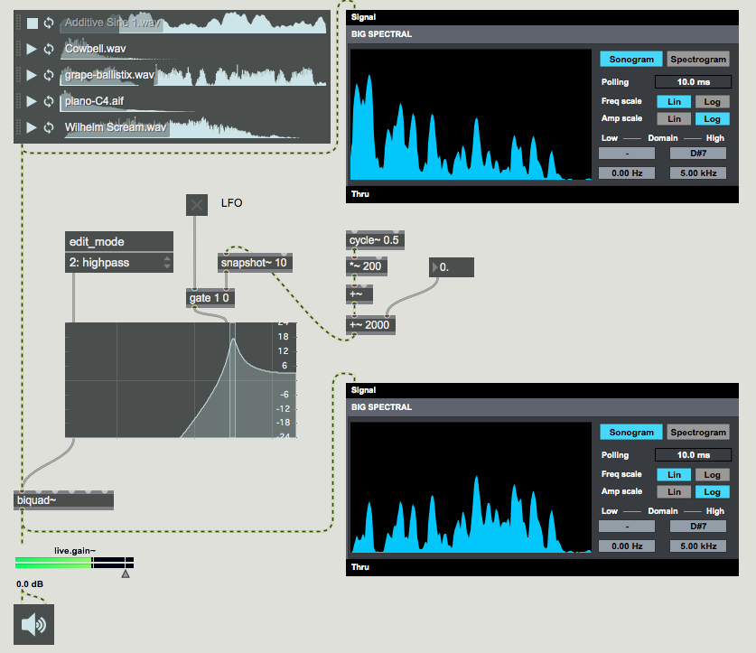

#LESSON 05 - CHAINING EFFECTS
###ORGANIZATION
I think in one of the last lessons, we may briefly have touched on the objects _send_ and _receive_. The idea with these two objects is that they let you keep your patch organized by removing unnecessary patch cords. So for example, if you had something in one place in your patch, and you wanted to send it to somewhere else, you could do it like so:

Send and receive are so flipping important that they have shorthands as well: _s_ and _r_. Something that I like to do when using send and receive is to make pairs of _s_ and _r_ objects the same color, which helps a bit when trying to makes sure you know where everything is. Another nice trick, if you double-click on a send or receive object while the patch is locked, you can see where all of the send and receive objects with the same name are in the patch. This, I think, is handy. Now, onto our first effect.

###DISTORTION

You may have noticed that if you play a sound too loud out of your speakers, the sound not only comes out way too loud but also with a different timbre than it did before. This is the general case of an effect called distortion, where the waveform itself is bent or misshaped, adding new harmonics and frequency content to the waveform.

Distortion can be easily realized in Max simply by clipping a signal. When the sound gets chopped off near the top, this nonlinearity in the sound introduces new frequency content which has the effect of brightening the signal. Try it out:

As you can see in the picture, you can use _clip~_ for hard distortion, or _tanh~_ for a slightly softer effect with less harshness.

###MORE ORGANIZATION

Now that we've got an effect as well as access to the _send_ and _receive_ objects, we can start to look at how to organize a patch using these. For a long time, we've been in the bad habit of throwing an _ezdac~_ all over the place whenever we wanted some sound to happen. We can do better. We can use _send~_ and _receive~_ to organize our sound into effects and outputs. We can also create a snippet so that we have an easier time creating and managing these objects.

If we put the distortion effect between the receive effects and the send effects, then it makes it easy for us to chain effects together, as we but complexity into our patch.

###FREQENCY SHIFTING
We've already seen what can happen when we look at the frequency decomposition of our patch. An interesting thing that we might try to do is to shift the frequency content up and down. I've heard this called harmonic rotation exactly once and I guess if you're being generous you could call it that. The spectrum rotates all over the place. Things that were harmonic start not to sound harmonic anymore, because the harmonic ratio between the partials starts to get all messed up.

You may notice in some of these sounds a very distinctive ringing. This can happend when subaudible frequencies get rotated back up into the audible range, and it starts to sound like a continuous tone. You can deal with this somewhat by doing some simple lowpass filtering, like I've done here. We haven't talked about lowpass filtering yet, but we definitely will.

###BITCRUSHING
Crush those bits. So we've talked just on the edges of sampling theory, and we won't go into way too much detail. First of all, there are two things that determine the quality of a recorded signal. The first is the sampling rate. This is how often the computer records a sample, the instantaneous pressure of the audio signal, and to record a frequency F it needs to be at least 2F (Nyquist theorem). Incidentally, increasing the sampling rate beyond this doesn't make the signal higher quality or provide any new audible information. But it might be useful for sounds that will be heavily processed, or slowed down or something. 

The _degrade~_ object can simulate downsampling. As you turn down the sampling rate ratio, Max can no longer represent the higher frequencies in a signal, and they start to fold back over into lower frequencies in a process called aliasing.

You can also reduce the bit depth, which is how many bits (or how much resolution) is used to capture each sample. In the limit (one bit) Max can only say for a given sample whether that sample is "high" or "low". The result is of course huge distortion. The distortion is especially bad for quiet sounds, since all of the subtlety near zero is lost.

###WAVESHAPING

There's **another** object for reading from a buffer that we haven't talked about yet. Don't worry, it's easy. The object is called lookup, and it's more or less expecting a sound as it's input. The idea with the lookup object is that you're re-mapping a sound. You're taking the loud parts of a signal and mapping them to loud values, and the quiet parts of the signal and mapping those to quiet values, but importantly your doing it just slightly differently so as to introduce bends and curves in the sound that can add harmonic content. 

You can draw directly in the buffer, which is fun. You can also use these buffer functions, which I'm pretty sure no one ever uses. Ironically, filling the buffer with a sine or cosine wave is easy, but filling it with a straight line takes some massaging. The important thing about sine and cosine waveshaping is that it adds harmonic content in a structured way. I can't remember what that way is, but you're free to look it up.

###BASIC FILTERING

We'll go just a bit deeper into filtering when we talk about delay lines and such, but for now just rest easy on the knowledge that the workhorse filter object in Max is called _biquad~_. This object can handle all the basic filter types, lowpass, highpass, bandpass, etc. The way it works, you connect it to either a _filtergraph~_ or a _filtercoeff~_ object. Then you can shape the frequency content of the sound as it plays.

###PUTTING IT ALL TOGETHER
Once you start adding a lot of these effects, you can put them between the send~ and receive~ objects in the effects chain, like we talked about, to get them to work. If you've got all that working, then we can talk about presentation mode. And all this to say that these aren't the only effects. I think the most interesting effects come when you start to layer these effects and when, through experimentation, you start to come up with your own.