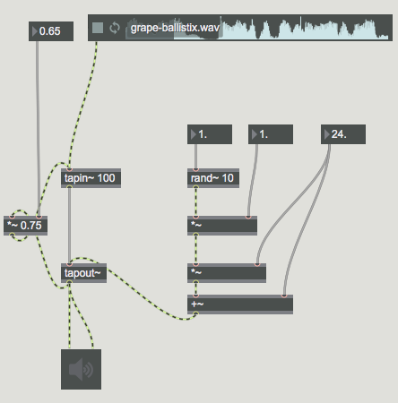

#LESSON 06 - DELAY + FILTER
Alright. Last time we were here we started to look at some audio effects. Today we'll go a bit deeper, and look in particular about delay lines and feedback. There's a lot of territory to cover here:

delay~ and comb filtering
karplus-strong synthesis
echo + reverb
doppler effect and pitch shifting
chorus, flange and phasing
staircase effects

###SAMPLE DELAY
With the delay~ object, we can delay an incoming signal by some number of seconds. If the sample rate is 44100 samples per second (which it usually is), then delaying a sound by 44100 samples of course represents a delay of one second. 

With a delay this long, we can hear two separate sounds, one arriving a full second after the other. But as we've seen many times in this course so far, interesting things can happen as we start to approach the time/frequency barrier. Suppose, for example, that we only delay the sound by a few samples before adding the sound to itself. Notice the quite interesting effect, which gets even more pronounced with a rich sound source. In fact, if you treat noise in this way, what you end up with looks like a bunch of ridges. What's going on here?

As usual, we can work out what's going on by reasoning about the component frequencies of this sound. Considering each frequency as a sine wave, it's easy to see that when you delay a sine wave and add it to itself, it can either be amplified or attenuated depending on the time of the delay. What you also should be able to see is that if a signal at frequency f is attenuated, then so is a signal at frequency 2f and 3f and so on. That's what gives this filter its characteristic shape, and is why this filter is often called a comb filter. It's such a useful effect that there's actually not one but two objects in Max dedicated to this effect exclusively: _comb~_ and _teeth~_. More on these in a bit.

###RECIRCULATING DELAY
So what can we do with such short delays? The downside to the delay~ object is that it cannot be used to create feedback. In fact, we can dramatically strengthen the comb filter effect, as well as create a number of new and interesting effects, if we make use of a delay that can feed back on itself. For this, we turn to the pair of objects _tapin~_ and _tapout~_.

Each _tapin~_ object creates a delay line, where the argument to _tapin~_ is the size of the delay and, therefore, the largest that the delay can possibly be. Each _tapout~_ object connected to _tapin~_ reads from that delay line, after a time specified to the _tapout~_ object. Unline almost every other object in Max, the connection between _tapin~_ and _tapout~_ if not for passing messages, but rather for defining the signal source for the _tapout~_ object. Anyway, what can we do with these objects? Well, an echo is easy to define:

This will be a nice long echo. Actually implementing good sounding reverb is a bit more complicated, but there are a few Max objects that can help us here, including _yafr_, or Yet Another Free Reverb. If you open this object up, you can see that it's basically build from a lot of delay lines, along with a few allpass filters. An allpass filter is just a filter with flat frequency response but complex phase response--more on that later, maybe.

When you've got all of these delay lines, one fun thing to play with is a delay network, where multiple delay lines, all with different delay times, feed into each other, creating interesting rhythmical effects. When playing around with this, just be careful that you don't accidentally blow up your delay line. Remember that when you send one signal to multiple places, you are in fact doubling the output. The same is true of multiple delay lines feeding back into the same source. In general, it can be hard to keep these things from blowing up, so be careful.

###KARPLUS STRONG SYNTHESIS + EXTREME COMB

We already saw how we could create a comb filter using a _delay~_ object to attenuate particular frequencies. Notice that the spacing of each amplified frequency was a whole number multiple of another frequency; in other words, the amplified frequencies were harmonically related. If we take a sound source and pass it through a very short recirculating delay, the effect is to create strong amplification of particular frequencies, which can sound a bit metallic.

Adding a filter to the loop, we can even use such a delay line for sound synthesis. If you think about it, a vibrating guitar sting basically does the same thing. A noisy energy source (plucking or strumming) causes the string to vibrate, but because of the length of the string only certain frequencies will remain. This is the essence of Karplus-Strong synthesis, which can be implemented as follows:

###DOPPLER EFFECT

Probably you've been outside before, in which case you've experienced the Doppler Effect. This is where something produces a sound as it moves towards or away from you, which causes its apparent pitch to go up or down. It's easy to see why if you draw a picture. For example, if the beginning of a sound takes two seconds to get to you but the end of the sound takes half a second, then you reduce the total time over which the sound plays by a second and a half. This is equivalent to playing the sound at an increased speed, which we've already seen has the effect of increasing its pitch. Hence, the doppler effect.

We won't go too deep into the maths here, but continuously varying the delay time using a phasor can create a constant shift in pitch, with an occasional discontinuity. 

###CHORUS + FLANGE

If you're going to use a Chorus or Flange effect, then you'll probably end up using a plug in or something, but I think it's pretty cool nonetheless to see how these things work. The basic idea is to continuously modulate the length of a delay line to produce an audio effect. Let's look at chorus, for example. The motivation behind the effect is to try to imitate the subtle effect of having a bunch of people or instruments playing together, with each one just slightly off pitch with the other. We already saw how pitch shifting could be implemented using a _phasor~_ along with a delay line. The idea with the chorus object is to use a constantly varying phasor, which can be realized using the object called _rand~_. This object outputs a range of random ramps. At random intevals, it ramps continuously to new random values.

If we plug the output of this into a delay line, we can create a chorus effect. Adding feedback increases the strength of the effect. 

Of course, taking the chorus effect and then layering it multiple times produces an even stronger effect. The effect can, in fact, become crazy-strong. To layer it mulpitle times, let's try busting out the _pvar_ object. What does the _pvar_ object do? Well, it lets us take an object that has a value (almost always an integer or a float), and then reference that object in multiple places in our patch. We'll use it even more later on today, when we talk about MIDI, but this can be sort of a preview of sorts for that. Say here in our patch, we wanted to use this chorus effect twice in parallel. The chorus effect has four parameters: the delay time, the chorus frequency, the chorus depth and the feedback amount. To use _pvar_, we first make a number object for each of these. Then, we name each one. Finally, we can create a _pvar_ object with the name of that number box associated with it, which allows us to change the value in the number box and see it updated in all associated pvar objects. It's a really handy way to change a whole bunch of things at once.

Before we leave off talking about chorus, I'd just like to encourage you to think about ways that you can use and abuse these effects. They've been made in a certain way, but that doesn't necessarily mean that you have to use them in that way. For example, with the chorus object, perhaps you'd like to use a recorded sound as your modulator, rather than a rand~ object. If you take a recorded sound and slow it down, the output really is a bit like a series of ramps, and you can create some pretty cool effects by mixing together multiple sound sources in this way.

###STAIRCASE EFFECTS
One technique that you can get a lot of mileage out of is something that I'm going to call staircase effects (this definitely has a more official name--it just happens that I don't know it). Here, the idea is for you to do something between each stage of your delay, causing some kind of stepping effect to occur between each echo in the delay. For example, you might add a frequency shift between each echo:

###ASSIGNMENT - ONE SAMPLE 
Make a piece using just one sample, but as many delay lines as you like.