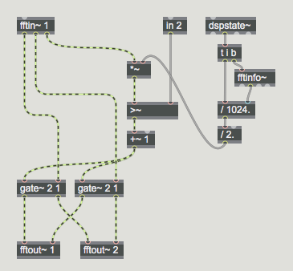

#LESSON 08 - PFFT
### INTRO
I think maybe we have something like polybuffer~ or karma~ scheduled for today, both of which are really really important, but I'm going to talk about fft today instead because we just finished talking about poly~ a lot, so I think it makes sense to talk about the FFT now.

What is the FFT? Well, as you know from chatting about it before, the FFT decomposes a sound into its constituent frenqencies. It's able to determine, for each frequency, both the magnitude and phase of that frequency in the original sound. How is it able to do this, and to do it so fast? Well the short answer is math. The medium answer is complex numbers. The long answer I can't really remember, but I swear there was a week during my sophomore year when I could have reimplemented the DFFT all by myself. 

Other than showing us what a sound looks like, what is an FFT actually good for? Well, let's look at a few examples.

### SETUP

So here's the thing about the FFT. While it can give you a very very good picture of the component frequencies of a sound, it also has the effect of blurring out the temporal content of a sound. In other words, which an FFT can tell us which frequencies are present, it can't tell us (at least not directly) where in the sound those frequencies occur. In applications, we get around this issue by chopping the sound into overlapping pieces, and running a discrete Fourier transform on each one. So, any time we do an FFT, we confront a tradeoff between frequency and time resolution. Short windows mean we know when events occur, but with poor frequency resolution. Long windows give us better frequency resolution, but poorer time resolution. The correct window depends on the application.

All this to say that in Max it's not a trivial thing to operate on the FFT of a sound. Actually doing a good overlap-add FFT is technically tricky. You have to chop the sound into pieces, window each piece, and then add all the pieces back together. So, you can't just run the audio through a magic fft object, do some stuff to the sound, and then ifft the result.

Instead, Max approaches the fft similar to _poly~_. Each **frame** of an fft is passed to an object called _pfft~_. That object loads a max patch which defines the processing for each fft frame. Then, the _pfft~_ object handles all the cumbersome overlapping-and-adding that makes working with the fft so tricky.

Since we're going to be loading a bunch of _pfft~_ subpatchers from one master patcher, this might be a good time to talk about Max projects. Up until now, we've dealt with each patch as a separate entity. Occasionally, when one patch needed to reference another, we made sure they were in the same folder, so that they could find each other. The more prinicpled way to associate a patch with other patchers and other media is using a project.

Making a project is easy. Just select File>New Project. Max will try to save it to some global Project folder. You can save it there, or just put it somewhere else. Up to you. Anyway, once you've done that, you'll see this gray rectangle thing, with a big plus asking you to add a drop in content.

To add a patch, click on the plus in the bottom-left. Then, click on Add New File... Finally, make a new file called master-pfft. This will be the main patch, where we'll show off all the cool things we'll learn to do with FFT. For our first fft treatment, we'll see how to split a sound by frequency.

### CROSS FFT

Cool, so try this. Using the same technique as before, save another patcher in the project, this one called cross-pfft. Now, open this one up. Make a new object called _fftin~_ and give it the argument 1. This is just line the _in_ object for _poly~_, only this one works for _pfft~_, rather than _poly~_. But other than that, they're the same. Go ahead and hover over the outlets. Notice that the one says Real input and the other says Imaginary output. For now, just notice that. Just notice it, accept it and don't worry about it. Worry instead about the last object, which says Bin Index. What the hell is that?

Well, taking the FFT of a windowed slice of sound gives you back amplitude and phase for a number of different frequencies. If you numbered each of those frequencies, that would be the bin index. Our goal is to separate out sound before and after a particular frequency. So, all be have to do is convert this bin index into a frequency. Fortunately, the formula for conversion is simple: the FFT divides the frequency spectrum into SR/(2*binsize) frequencies, where SR is the sampling rate. So, an object that will split up our frequencies is as simple as follows:

As you can see, this treatment will let us separate a sound into components above and below a particular frequency.

### NOISE GATE

Another easy application of the FFT is a simple noise gate. The idea here is to simply remove any frequencies that are too quiet. It's very straightforward, all we have to do is figure out the amplitude of a particular frequency, then slice it out if it gets to be too quiet.

The only problem is, we're stuck with this real-imaginary thing instead of an actually useful amplitude and phase. What are we to do? Easy, converting real-imaginary to amplitude-phase is a piece of cake. First, just realize that the two are the same. Each refers to a point on the circle, one according to the X and Y coordinate of that point, the other by its angle and radius. Next, just use the _cartopol~_ and _poltocar~_ objects, which make the whole thing easy. Add a couple of gates, and you've got a very easy noise gate:

One thing you may notice is that this gate isn't... exactly... the best. If we have time and if you're really interested, we can take a look at how to improve it in part by using an object called _vectral~_. For now, I thing it's more interesting to move on to...

### FREQUENCY SHIFTING
Hey, remember when we did this with an object called _freqshift~_? Well, we can also do it ourselves using a _delay~_ object inside of an fft. Doing it this way, however, lets us shift the phase and amplitude separately. This can have a very weird effect, especially on steadier sounds like some of the ones we've been working with. And technically it's not really doing the same thing as _freqshift~_, but it's weird and interesting, and that's good enough for me.

### VOCODING
Now we get to talk about something really cool: vocoding. We've already seen techniques that fall under the broad umbrella of subtractive synthesis, where we start with a rich sound source (like a sawtooth wave or some noise) and hone it down to a particular range of frequencies using filters and envelopes. It turns out that the human voice is a subtractive synth. It's basically a buzzer at the end of a long, malleable tube. Pitch comes from the tightness of your vocal cords, and the particular vowels are shaped by resonant cavities in your neck and head. There's also a thing called Tuvan Throat Singing. It's really cool.

You can see what I'm talking about in the audacity files for this lesson. 

The original idea behind the vocoder was to compress speech by representing it in these terms: buzzing + filters. This was originally accomplished using a bank of filters, but we can also accomplish the same thing using _pfft~_. Make a new max patch named vocoder-pfft. Fill it as follows.

Then make the master vocoder. Notice how we use _zerox~_ as a cheap and easy way to detect contonants, and how we switch between the two. 

There's a couple of other cool variations we can explore. The first is simply to use pitch detection to add some variety to our fundamental pitch. Also, we can slow down or quantize those pitch updates, to achieve a "glados" voice effect.

Finally, you don't have to use a sawtooth wave. It's what people usually do, but it's certainly not somethingy ou have to do. For example, you can use wavetable synthesis to generate your source tone.

### BIN SYNTHESIS

One neat thing about _pfft~_ is that it can also reference a buffer. This can be useful for certain kinds of synthesis. For example, say we specified our amplitude using an external buffer, that we could manipulate and draw into. Here's what that might look like:

