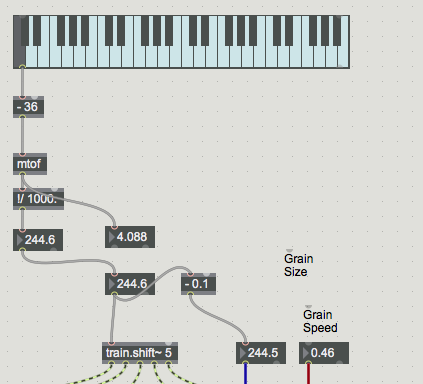

#LESSON 11 - AGAINST THE GRAIN
### Omnislider
We've got a ton to talk about today, some of it interesting, some of it maybe pretty boring, so let's start with the boring stuff first and then we'll finish with the cool stuff. I'll preface this boring stuff, however, by saying that it's actually pretty cool, and that you'll be hard pressed to find another Max class that covers this particular subject.

Alright, so we've already seen the send/receive objects, the ones that get rid of patch cords and replace them with named objects. We've also just barely talked about the scripting name attribute for Max objets. This scripting name is our first stop on the road to the omnislider.

Remember that when working with the _buffer~_ object, we don't usually send messages to the object directly, but rather refer to it by name. Objects like _play~_, _groove~_ and _wave~_ all take the name of a buffer as an argument, then use that buffer to synthesize their sound. The scripting name of an object works in a very similar way. We can use that name to send messages to an object without patchcords. Why is that useful? Check it out.

Step one, make a live.dial. Open up the inspector, for that live.dial. Make sure the attribute "Link to Scripting Name" is ticked, then set the Long Name to "KnobA" and the Short Name to whatever you want. "Fatness" for example. The short name just defines how the object will be labeled in the patch--the long name is the internal label for the object.

Step two, do the exact same thing for another live.dial, only give this one a different Long and Short Name. I went with "KnobB" and "Tallness". 

Nice, we're making good progress. In the next step, all we have to do is drop a couple of objects into our patch. One is called _autopattr_, the other is called _pattrstorage_. We won't go too deep into these objects, since they're a little bit complicated and we don't really have time. But you can think of _pattrstorage_ as a dictionary containing values for all the named objects in our patch. And all the _autopattr_ object does is automatically add these objects to _pattrstorage_. That's really all you need to know. After you drop these two objects in your patch, lock the patch and double-click on the _pattrstorage_ object. You should see something like this:

Alright, now stay with me because this is where things are going to get a tiny bit complicated. First, we need to make a umenu object, then fill it with the names of these two objects. To do that, we're going to use a _pattrhub_ object to crawl the _pattrstorage_ dictionary and return all the keys. That looks something like this:

You'll of course have to double-click on that _loadbang_ to fill up your _umenu_. Last step, add an object to your patch called _pattrforward_. Make a messagebox with [rawfloat $1] between the umenu and the _pattrforward_ and connect them up like shown in the picture. Finally, add a **regular** slider to the patch, and **make sure that it's outputting 0-1 floats**. Surely you can do that by now...

Do you see this? Do you see what's happening here? Man I promise you, if you don't know, this is some high level Max shit, trust me. We have one input, the omnislider, but at will we can map that slider anywhere we want. We could control a filter cutoff, resonance, distortion, whatever we want. And the only requirements are that the value we want to control (1) responds to the rawfloat message and (2) has a scripting name. If you still don't see why this is useful, just make a snippet out of it and hold onto it for later. 

Alright, boring stuff over.

### 2d or not 2d
This is a hard object to talk about sometimes, since it doesn't necessarily fit snugly anywhere in the course. But it's not totally unlike granular synthesis, and we're going to talk about granular synthesis today, so I figured we may as well talk about 2d.wave~.

So what does this object do? Basically, it's like _wave~_, except it works in two dimensions. What the hell does that mean? Well, _2d.wave~_ takes a buffer and divides it evenly into some number of chunks. _2d.wave~_ calls these chunks rows. Now, if you recall, _wave~_ also took as input the signal from a _phasor~_, which as it ramped from 0 to 1 would scrub through the input buffer that you'd given it. With only one row, _2d.wave~_ works exactly the same. However, it also takes a second phasor input, which specifies from which row _2d.wave~_ should be reading. So, as the second phasor ramps, it crossfades between each chunk of the source buffer.

This can be an incredibly versitile effect. Try this: set the first phasor to have a speed of one (the exact speed of the first phasor will depend on the length of the sample divided by the number of rows) and the other phasor to have a very low speed. Make the number of rows something reasonable, under 10 or so. You will hear something like preset 1, little loops of piano fading in and out. Kind of an "it's gonna rain" kind of effect. 

Now, leave everything else alone, but bump the number of rows up. Way up. Maybe to 100 or so. If you keep bumping it, eventually you'll cross a perceptual threshold, and you'll get this nice (I think it's nice anyway) warbling sound. Call this preset 2.

Next interesting thing to try, set the second phasor's speed to zero. Attach a number box to the second inlet of the second phasor, and now you can scrub through the sound file. Neat. This will be preset 3.

Now, try setting the speed of the first phasor to be quite low, and the speed of the second phasor to be very high. All of a sudden you've got a very interesting texture generator. See how playing with the speed of the first phasor, as well as the number of rows, affects the brightness of the timbre but not the pitch. This is preset 4.

Finally, just notice that you don't actually _have_ to set the speed of either phasor to be a positive number. When these are negative, you can scroll backwards through the sound file, or play pieces of the soundfile backwards. (preset 5)

One last thing that I ought to mention, you don't need to drive the second phasor with a continuous signal either. In fact, if you use an object called _round~_, you can force the second signal to always fall in just the right place so that it plays back a row from the buffer exactly, rather than interpolating between rows. In this way you can make a kind of randomized sampler, or you can step through the sample one row at a time. With a very large number of rows, this can start to sound a bit like some kind of vocoder...

### GRANULAR SYNTHESIS

Cool, so there's lots and lots and lots of ways to do granular synthesis in Max. They all have their advantages and disadvantages. So, this whole section has to come with a big disclaimer: This may not and indeed probably is not the best way to do granular synthesis in Max. But I find it works pretty well, so for now we're going to stick with it.

First things first, we're going to need Nathan Wolek's granular synthesis toolkit, which you can get at this address http://www.nathanwolek.com/2007/03/granular-toolkit-v1-49/. It's an old package and not 100% optimized for being installed in Max 7, so follow these steps exactly.

1. Download the toolkit
2. Create a folder called _gtk_ in ~/Documents/Max 7/Library/
3. Unzip the toolkit and move all of its contents to the newly created _gtk_ folder.

If you're able to instantiate one of the _grain_ objects, like _grain.stream~_ for example, then you're good to go.

### NO PAIN NO GRAIN

What is this whole zany granular synthesis thing anyway? For the complete answer, simply read this entire book cover to cover and listen to all of the samples on the attached audio CD http://www.musicainformatica.org/read/curtis-roads-microsound.php

The short answer is this: lots of very short sounds, played closely together. These short sounds are called grains, and by short we usually mean from about 10 to 150 milliseconds long. 

Why this length? Remember that both mathematically and biologically, for us to detect the frequency of a sound it has to last through at least two full cycles. The period of a sound is inversely proportional to its frequency, so a 10 Hz sound has a period of 100ms. The longest period that can fit twice into 10 milliseconds is 5ms, or a frequency of 200 Hz. So a 10ms grain, by definition, can't contain any frequency information below 200 Hz. Of course, if we stack multiples of this grain together that may change, but more on this later.

Key features of a grain include how long it is, how fast we play it back, how many grains we play at once, how evenly those grains are spaced and what windowing function we apply to each grain. The GTK library gives us four different objects for working with grains: _grain.bang~_, _grain.pulse~_, _grain.phase~_ and _grain.stream~_. I don't really ever use _grain.bang~_, but for completeness here's how it works.

As you might expect, sending a bang to this object will cause it to play back a grain. The three values passed to the other inlets control: the offset from the beginning of the sound file, in milliseconds, the millisecond length of each grain and the speed at which the grain will be played back. A word of caution with these objects: only use one channel buffers, or you'll regret it.

With a trigger on our slider, we can finally, _finally_ make the grain based scrubber of our dreams.

The right outlet of the _grain.bang~_ object sends a bang whenever the grain.bang~ object receives a bang while it's still playing back a grain. In other words, it's the spillover outlet. If you chain these grain.bang~ objects together, you end up in effect with a kind of crude poly~.

The _grain.bang~_ object is really handy, the only downside is that it doesn't give you signal-rate control over the playback of your grains. Every time you send _grain.bang~_ a bang, it has to wait until at least the next DSP vector to actually start playback. The _grain.pulse~_ object gets us around this problem. We haven't talked about the object _train~_ yet, but basically it's the equivalent of _phasor~_ but for square waves. Unlike the _rect~_ object, which generates an antialiased squarewave that we can listen to, the output of _train~_ is a true square, better used for controlling and triggering stuff. Anyway, _grain.pulse~_ fires a grain on a signal transition from 0 to nonzero. So, if we use a _grain.pulse~_ like so, we can effect a grain that fires 10 times a second.

Something that's particularly interesting with this setup is the possibility to play a whole bunch of grains right next to each other, with a particular phase relationship. In other words, if you're playing one grain every 100 milliseconds, you might add additional grains at 20, 40, 60 and 80 milliseconds. There's an object included in the _gtk_ that can help with this, called _train.shift~_. Especially for very short grains, this can lead to some very interesting timbres.

You'll find here that, especially when the grains get quite short, that the grain speed doesn't really correspond to the perceived pitch of the resulting texture. In fact, this has much more to do with the frequency of the grains, especially when they overlap as in this example.

Adding just a touch of noise to your grains can bring about a really nice effect. Suppose that you add constant variety to the playback position of your grains, for example. This can have the effect of varying slightly the texture of each grain, giving the the resulting sound some phasing and dynamics.

Now, wouldn't it be cool if we could change the speed of these grains while they were playing back? Well, we can, with _grain.phase~_. But there's no way we have time to go into that here. You'll have to research it on your own.

