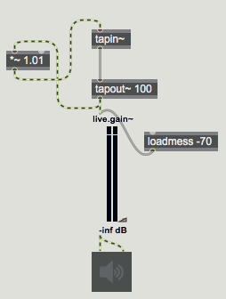
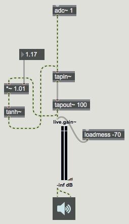
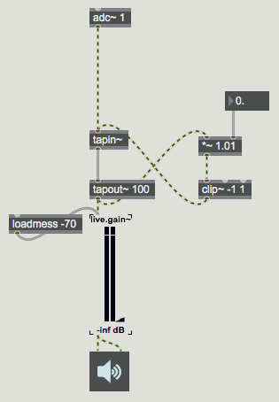
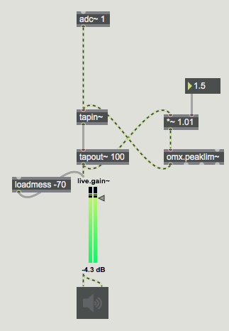
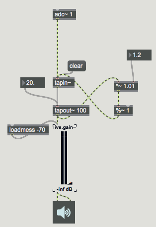
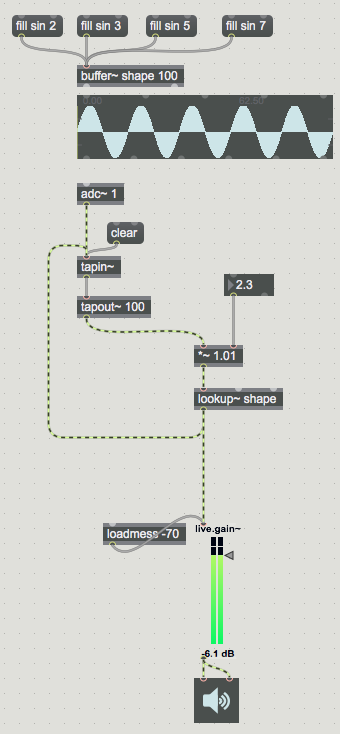
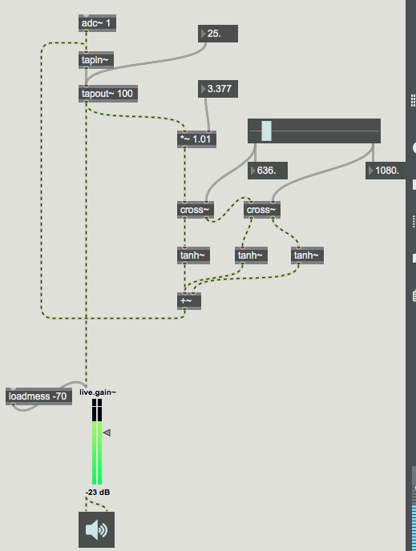
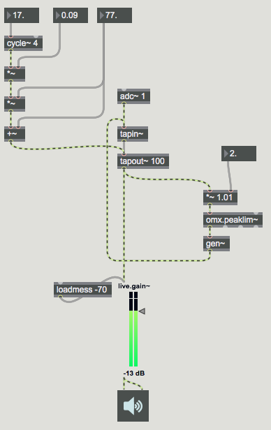

#LESSON 12 - GOOD KARMA
Note--for this lesson it is highly recommended either to make available a pair of headphones or a contact microphone
### Textures
Back when we talked about delay networks, we make it clear that you're not supposed to multiply the sound in your delay line by more than one, otherwise things could blow up. Well, what if you do it anyway?

This of course will just quickly get out of hand, and very quickly sound like garbage. But we've already seen a number of techniques that can limit the amplitude of a signal to fall within a specific range. Each of these can be used to implement a kind of sustaining delay line that can produce an interesting texture. None of these is well defined or mathematically rigorous, but they're all interesting.

We haven't talked about compression, and we won't really, but you can think of compression as being quite similar to a tanh function in that it affects signals that woudl clip much more than signals that wouldn't. It's overall effect is to quiet only the loudest parts of a signal. You can use peak limiting compression in a delay line like so:

One of the crazier ways to force the signal to a specific range is using a modulo operation. Modulo is the remainer function. If we take a number modulo 2, it's the same as the remainder when that number is divided by two. So 1 modulo 2 is 1, 2 modulo 2 is zero, and 3.5 modulo 2 is 1.5. The effect is to wrap values back around when they go past the modulo value. With a signal rate version of modulo, we can make a delay line like this one:

Also, remember waveshaping? This too can be an interesting way to effect a clipping function on our sounds. As long as the buffer begins and ends at 0, it's impossible for the signal to grow forever.

With all of these techniques, creativity and experimentation are critical. Play around with the setup until you find things to control that are interesting, and then give yourself knobs to control those things. Here, for example, is a feedback setup that uses a crossover filter in conjunction with some of the limiting techniques we've looked at so far. I don't pretend to really understand it but it makes nice noises:

On and don't forget, you can also apply chorus, flange and phasor effects to these if you want!

Anyway, enough about textures. Let's talk about _karma~_

### KARMA

So up until now, we really haven't talked about how to record sounds in Max doing anything other than using the Quickrecord extra. Of course, if you did any research on your own you would have found the record~ object, which does indeed let you record into a buffer. We haven't talked about _record~_ at all mostly because I don't really like it. It's fine for certain applications, but usually what I want to do with recording is much better served by the _karma~_ object. 

First, install karma. There's a package called karma, so installing is super easy--just install the package. Next, let's take a look at how karma works.

